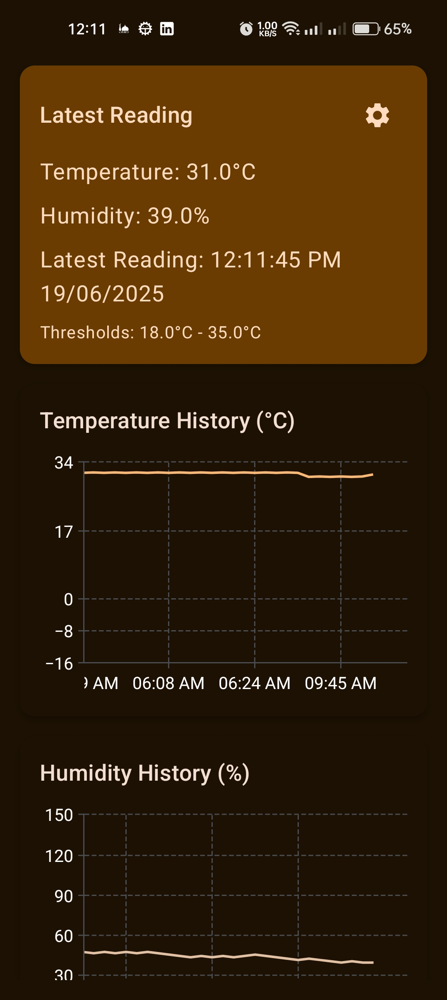
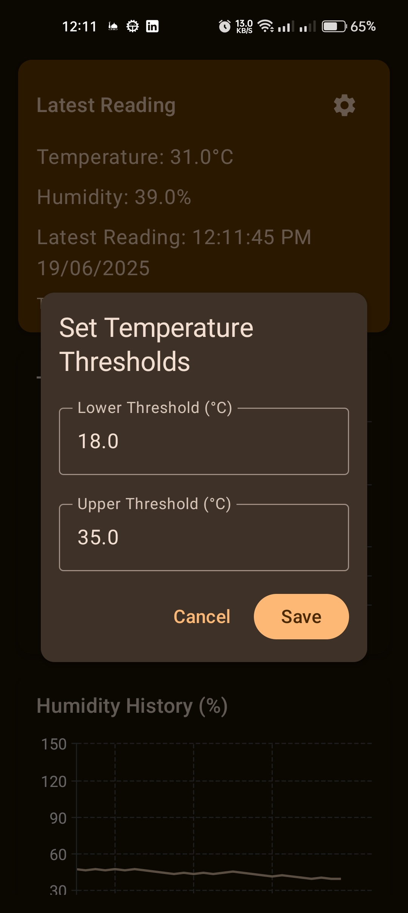
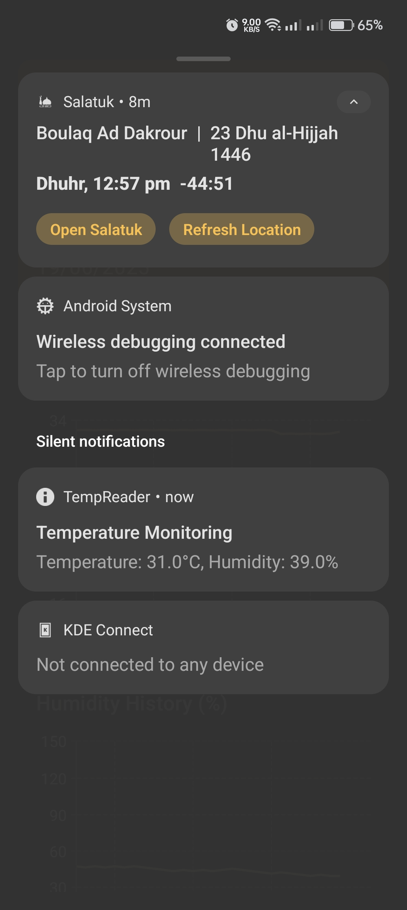

# IoT Environmental Monitor with ESP8266 and Android

**A complete, end-to-end solution for monitoring real-time temperature and humidity using an ESP8266 sensor node and a native Android application. This system provides live data visualization, historical charts, and critical alerts, making it perfect for monitoring sensitive environments like server rooms, greenhouses, or your own living space.**

## Table of Contents

- [Project Overview](#project-overview "null")

- [Core Features](#core-features "null")

- [System Architecture](#system-architecture "null")

- [Scalability & Future Improvements](#scalability--future-improvements "null")

- [Technology Stack](#technology-stack "null")

  - [Hardware](#hardware "null")

  - [Software & Cloud](#software--cloud "null")

- [Android App Showcase](#android-app-showcase "null")

- [How to Build Your Own](#how-to-build-your-own "null")

  - [Part 1: Setting Up the Hardware (ESP8266 Sensor)](#part-1-setting-up-the-hardware-esp8266-sensor "null")

  - [Part 2: Setting Up the Backend (Firebase)](#part-2-setting-up-the-backend-firebase "null")

  - [Part 3: Setting Up the Android Application](#part-3-setting-up-the-android-application "null")

- [ESP8266 Sensor Code](#esp8266-sensor-code "null")


## Project Overview

This project is a full-stack IoT solution that bridges the physical and digital worlds. An ESP8266 microcontroller equipped with a DHT11 sensor periodically measures temperature and humidity. This data is transmitted over WiFi to a Google Firebase Realtime Database.

A native Android application, built with modern tools like Jetpack Compose and Kotlin, acts as the user-facing dashboard. It fetches the data from Firebase, stores it locally for offline access using a Room database, and presents it to the user through an intuitive interface. The app not only shows the latest readings but also visualizes historical data in interactive charts and sends push notifications for critical events, such as network loss, stale data, or when temperature thresholds are breached.

## Core Features

- **Real-time Data Monitoring**: View live temperature and humidity readings as they are sent from the sensor.

- **Historical Data Visualization**: Interactive charts display the history of temperature and humidity, allowing users to track trends over time.

- **Critical Alerts & Notifications**:

  - Receive push notifications if the temperature goes above or below user-defined thresholds.

  - Get alerted if the sensor stops sending data ("Stale Data" alert).

  - Get notified of network connectivity issues.

- **Offline First Architecture**: The Android app uses a local Room database to cache data, ensuring the app is fully functional even without an internet connection. It seamlessly syncs with the cloud once connectivity is restored.

- **Robust Background Service**: A persistent Android service ensures that temperature checking and notifications continue to work even when the app is not in the foreground.

- **Power Efficient Sensor**: The ESP8266 code is optimized to send data at a defined interval (e.g., every minute) to conserve power.


## System Architecture

The project is composed of three main parts that work in concert:

1. **Hardware Node (The Sensor)**: An ESP8266 microcontroller with a DHT sensor. Its sole job is to read environmental data and push it to the cloud.

2. **Cloud Backend (The Bridge)**: Google Firebase Realtime Database acts as a simple, real-time, and scalable backend. It receives data from the ESP8266 and makes it instantly available to the Android app.

3. **Client Application (The Dashboard)**: A native Android app that serves as the user interface for the entire system.


```
+----------------+      +--------------------------+      +-----------------+
|   ESP8266 &    |      |                          |      |   Android App   |
|   DHT Sensor   | ===> | Google Firebase Realtime | <==> | (Jetpack Compose|
| (Hardware Node)|      |         Database         |      |   Room, Kotlin) |
+----------------+      +--------------------------+      +-----------------+
```

## Scalability & Future Improvements

While the current implementation is designed for a single sensor and user, the architecture is highly scalable. Here’s how it can be expanded:

- **Multi-Device Support**: The current design uses a specific User ID (UID) to link the ESP8266 to the Android app. To add more sensors, you can create new users in Firebase Authentication. Each new ESP8266 device would be programmed with the credentials of its own dedicated user.

- **Dynamic Android App**: The Android application can be enhanced with a login/registration screen using Firebase Authentication. After a user logs in, the app would dynamically fetch that user's UID and listen for data at the correct path (e.g., `/UsersData/{loggedInUserUID}/readings`). This would allow a single app to monitor different sensors simply by logging into the associated account.


## Technology Stack

### Hardware

- **Microcontroller**: ESP8266 (NodeMCU or similar)

- **Sensor**: DHT11 (or DHT22 for higher accuracy)


### Software & Cloud

- **Android Development**:

  - **Language**: Kotlin

  - **UI**: Jetpack Compose

  - **Architecture**: MVVM (Model-View-ViewModel) with a Repository pattern

  - **Asynchronous Programming**: Kotlin Coroutines & Flow

  - **Local Database**: Room

  - **Charting Library**: [Vico](https://github.com/patrykandpatrick/vico "null")

- **Backend**: Google Firebase (Realtime Database & Authentication)

- **Embedded Development**: C++ (Arduino Framework)


## Android App Showcase
 
 

## How to Build Your Own

This section provides a step-by-step guide to recreating this project.

### Part 1: Setting Up the Hardware (ESP8266 Sensor)

**Hardware Needed:**

1. ESP8266 Development Board (e.g., NodeMCU)

2. DHT11 or DHT22 Temperature and Humidity Sensor

3. Breadboard and Jumper Wires


**Wiring:**

- Connect the **VCC** pin of the DHT sensor to the **3.3V** pin on the ESP8266.

- Connect the **GND** pin of the DHT sensor to a **GND** pin on the ESP8266.

- Connect the **Data** pin of the DHT sensor to pin **D4** on the ESP8266.


**Software Setup:**

1. **Install Arduino IDE**: If you don't have it, download and install the [Arduino IDE](https://www.arduino.cc/en/software "null").

2. **Add ESP8266 Board Manager**:

  - In the IDE, go to `File > Preferences`.

  - In "Additional Boards Manager URLs", add: `http://arduino.esp8266.com/stable/package_esp8266com_index.json`

  - Go to `Tools > Board > Boards Manager`, search for "esp8266" and install it.

3. **Install Libraries**:

  - Go to `Tools > Manage Libraries...`.

  - Search for and install the following libraries:

    - `DHT sensor library` by Adafruit

    - `Firebase ESP Client` by Mobizt

4. **Load the Code**:

  - Open the Arduino code provided at the end of this README.

  - Update the placeholder values for WiFi, API Key, etc.


### Part 2: Setting Up the Backend (Firebase)

1. **Create a Firebase Project**: Go to the [Firebase Console](https://console.firebase.google.com/ "null") and create a new project.

2. **Enable Authentication**:

  - In the console, go to `Build > Authentication`.

  - Click `Get Started`.

  - Select the "Email/Password" sign-in method and enable it.

  - Go to the "Users" tab and add a new user (e.g., `admin@gmail.com`). This is the user the ESP8266 will log in as. Note down this user's UID from the user table, as this is the link between the device and the data.

3. **Set Up Realtime Database**:

  - Go to `Build > Realtime Database`.

  - Click `Create Database` and start in **test mode** for easy setup.

4. **Get Your Credentials**:

  - **Database URL**: Find this on your Realtime Database main page. It will look like `https://your-project-name-default-rtdb.firebaseio.com`.

  - **Web API Key**: Go to `Project Settings > General`. Your Web API Key is listed there.


### Part 3: Setting Up the Android Application

1. **Connect App to Firebase**:

  - In the Firebase console, go to `Project Settings` and click "Add app".

  - Select the Android icon.

  - Follow the on-screen instructions to register your app, using your app's package name (e.g., `com.example.tempreader`).

  - Download the `google-services.json` file and place it in the `app` directory of your Android Studio project.

2. **Clone & Build**:

  - Clone the project repository.

  - Open the project in Android Studio.

  - Build and run the app on an Android device or emulator.

3. **Code Configuration Note**:

  - To make the Android code cleaner and easier to maintain, the Firebase URL and data path are centralized as constants in the `ReadingRepository` class. The initial setup points to a specific user's data path. To support multiple users (as described in the Scalability section), this path would be constructed dynamically after a user logs in.


    ```
    class ReadingRepository(private val readingDao: ReadingDao) {
    
        companion object {
            const val FIREBASE_URL = "https://your-database-url.firebaseio.com"
            // The {user_uid} part would be replaced dynamically
            const val FIREBASE_PATH_TEMPLATE = "/UsersData/{user_uid}/readings"
        }
    
        // ... rest of the repository code
    }
    ```


## ESP8266 Sensor Code

This is the code to be uploaded to your ESP8266 board. Remember to fill in your credentials.

```
#include <ESP8266WiFi.h>
#include <Firebase_ESP_Client.h>
#include <DHT.h>
#include <NTPClient.h>
#include <WiFiUdp.h>
#include <TimeLib.h>

// ========== UPDATE THESE VALUES ==========
#define WIFI_SSID "YOUR_WIFI_SSID"
#define WIFI_PASSWORD "YOUR_WIFI_PASSWORD"
#define API_KEY "YOUR_FIREBASE_WEB_API_KEY"
#define USER_EMAIL "YOUR_FIREBASE_AUTH_EMAIL"
#define USER_PASSWORD "YOUR_FIREBASE_AUTH_PASSWORD"
#define DATABASE_URL "YOUR_FIREBASE_DATABASE_URL" // e.g., https://project-123-default-rtdb.firebaseio.com
// =======================================

// DHT sensor configuration
#define DHTPIN D4
#define DHTTYPE DHT11  // Change to DHT22 if you're using that sensor
DHT dht(DHTPIN, DHTTYPE);

// Firebase objects
FirebaseData fbdo;
FirebaseAuth auth;
FirebaseConfig config;
#include "addons/TokenHelper.h"
#include "addons/RTDBHelper.h"

String uid;
String databasePath = "/readings";
const long sendInterval = 1 * 60000;  // Send data every 60 seconds

// NTP Client
WiFiUDP ntpUDP;
NTPClient timeClient(ntpUDP, "pool.ntp.org", 0, 60000);

// Helper for WiFi connection
void initWiFi() {
  WiFi.begin(WIFI_SSID, WIFI_PASSWORD);
  Serial.print("Connecting to WiFi");
  while (WiFi.status() != WL_CONNECTED) {
    Serial.print(".");
    delay(500);
  }
  Serial.println("\nConnected! IP: " + WiFi.localIP().toString());
}

// Helper for LED control
void setLED(bool on) {
  digitalWrite(LED_BUILTIN, on ? HIGH : LOW);
}

// Helper for getting a Unix timestamp
long getFormattedLongTime() {
  timeClient.update();
  return timeClient.getEpochTime();
}

void setup() {
  Serial.begin(115200);
  dht.begin();
  initWiFi();
  timeClient.begin();

  pinMode(LED_BUILTIN, OUTPUT);
  setLED(false);

  // Firebase configuration
  config.api_key = API_KEY;
  config.database_url = DATABASE_URL;
  auth.user.email = USER_EMAIL;
  auth.user.password = USER_PASSWORD;

  config.token_status_callback = tokenStatusCallback;
  config.max_token_generation_retry = 5;

  Firebase.reconnectWiFi(true);
  Firebase.begin(&config, &auth);

  // Wait for user UID
  Serial.print("Getting User UID");
  while (auth.token.uid == "") {
    Serial.print(".");
    delay(1000);
  }
  uid = auth.token.uid.c_str();
  databasePath = "/UsersData/" + uid + databasePath;
}

void loop() {
  if (Firebase.ready()) {
    // Turn on the LED to indicate data is being sent
    setLED(true);

    // Read DHT sensor
    float humidity = dht.readHumidity();
    float temperature = dht.readTemperature();

    if (isnan(humidity) || isnan(temperature)) {
      Serial.println("Failed to read from DHT sensor!");
      setLED(false); // Turn off LED if there's an error
      delay(2000); // Wait before retrying
      return;
    }

    long currentTimeLong = getFormattedLongTime();
    String path = databasePath + "/" + currentTimeLong;

    // Create JSON object
    FirebaseJson json;
    json.set("temperature", temperature);
    json.set("humidity", humidity);
    json.set("timestamp", currentTimeLong);

    // Send to Firebase
    Serial.printf("Temperature: %.1f°C, Humidity: %.1f%%\n", temperature, humidity);
    if (Firebase.RTDB.setJSON(&fbdo, path.c_str(), &json)) {
      Serial.println("Data sent successfully");
    } else {
      Serial.println("Failed to send data: " + fbdo.errorReason());
    }

    // Turn off the LED after data is sent
    setLED(false);
    
    // Wait for the next interval
    delay(sendInterval);
  }
}
```